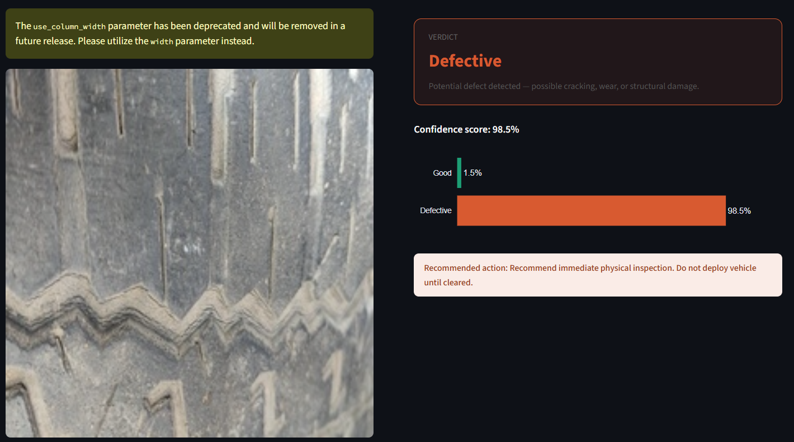
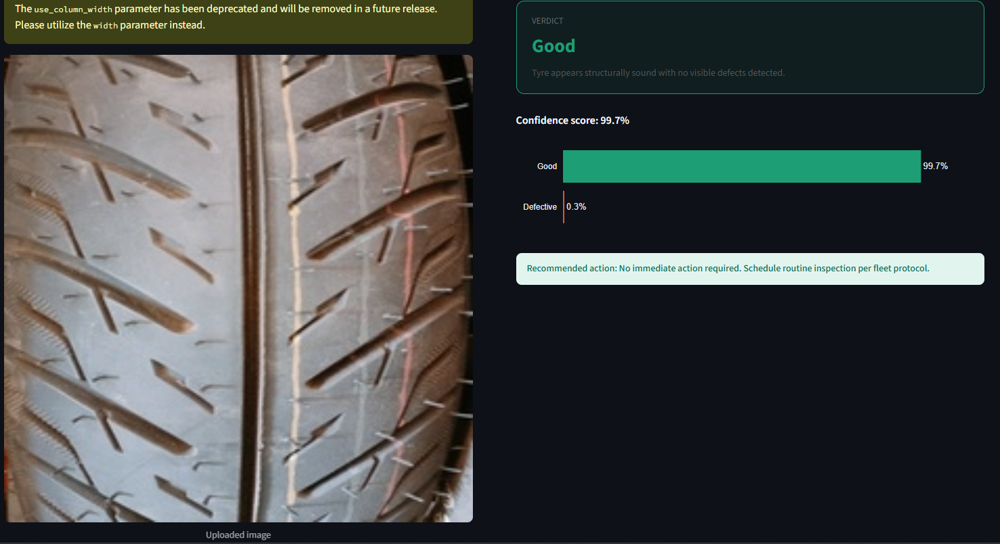
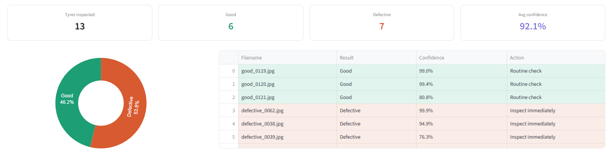
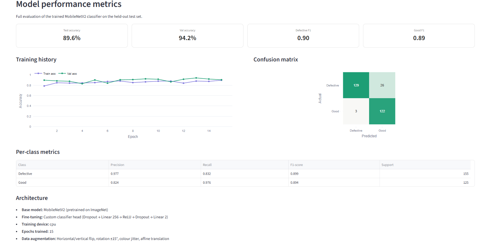

# Fleet AI — Tyre Defect Detection System

A computer vision system that tells you whether a tyre is safe or needs immediate attention. Upload an image, get a verdict in under a second.

Built this because tyre failures are one of the leading causes of vehicle breakdowns in fleet operations — and most inspections are still done manually by eye. This automates that.

---

## What it does

You upload a tyre image. The model looks at it and tells you:
- Whether it's **good** or **defective**
- How confident it is (e.g. 98.5%)
- What action to take ("No immediate action" vs "Do not deploy vehicle until cleared")

There's also a **batch mode** where you upload an entire fleet's worth of images at once and get a full inspection report you can download as a CSV.

---

## Screenshots









---

## Model performance

Trained on 1,700+ real tyre images collected from car and bike service stations.

| Metric | Score |
|---|---|
| Test accuracy | 89.6% |
| Validation accuracy | 94.2% |
| Defective F1 | 0.90 |
| Good F1 | 0.89 |
| Defective precision | 0.977 |

The defective precision of 0.977 is the number that matters most for a safety system — it means when the model flags a tyre as defective, it's right 97.7% of the time. Very few safe tyres get pulled unnecessarily.

---

## How it works

MobileNetV2 pretrained on ImageNet, fine-tuned on tyre images. Transfer learning was the right call here — the dataset is ~1,700 images which isn't massive, so starting from a pretrained backbone and only training the classifier head meant the model converged fast and generalised well.

**Training setup:**
- 15 epochs on CPU (~10 minutes)
- Data augmentation: random flips, rotation ±15°, colour jitter, affine translation
- Custom classifier head: Dropout → Linear 256 → ReLU → Dropout → Linear 2
- Optimiser: AdamW with ReduceLROnPlateau scheduler

---

## Run it yourself

```bash
git clone https://github.com/vanshk3/fleet-ai
cd fleet-ai
pip install -r requirements.txt
```

You'll need the dataset and trained weights to run predictions. Dataset from Kaggle:

```bash
kaggle datasets download -d warcoder/tyre-quality-classification
tar -xf tyre-quality-classification.zip -C data/raw/
python utils/prepare_data.py
python train.py
```

Then launch the app:

```bash
streamlit run app.py
```

---

## Project structure

```
fleet_ai/
├── app.py                   main Streamlit app (3 pages)
├── train.py                 training script
├── requirements.txt
├── utils/
│   ├── inference.py         model loading and prediction
│   └── prepare_data.py      dataset preparation and splitting
├── models/
│   └── metadata.json        accuracy scores, confusion matrix, training history
└── screenshots/
```

---

## Run it locally

Clone the repo and run it yourself in under 10 minutes:
```bash
git clone https://github.com/vanshk3/fleet-ai
cd fleet-ai
pip install -r requirements.txt
python train.py
streamlit run app.py
```

Dataset: [Kaggle — Tyre Quality Classification](https://www.kaggle.com/datasets/warcoder/tyre-quality-classification)

---

## Tech stack

Python · PyTorch · MobileNetV2 · Streamlit · Plotly · Transfer Learning

---

Built by [Vansh](https://linkedin.com/in/vanshk3) — MSc Data Science, University of Bath
